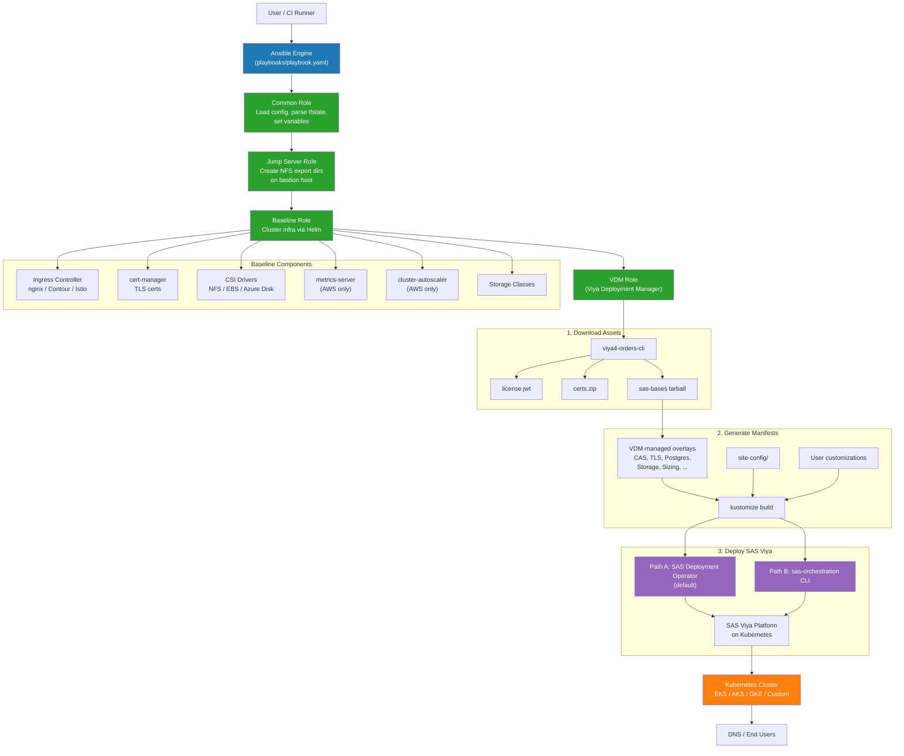

# SAS Viya 4 Deployment

## Table of Contents

- [Overview](#overview)
- [Prerequisites](#prerequisites)
  - [Technical Prerequisites](#technical-prerequisites)
  - [Infrastructure Prerequisites](#infrastructure-prerequisites)
    - [Kubernetes Cluster](#kubernetes-cluster)
    - [Storage](#storage)
    - [Jump Box Virtual Machine](#jump-box-virtual-machine)
- [Getting Started](#getting-started)
  - [Clone this Project](#clone-this-project)
  - [Authenticating Ansible to Access Cloud Provider](#authenticating-ansible-to-access-cloud-provider)
  - [Customize Input Values](#customize-input-values)
    - [Ansible Vars File](#ansible-vars-file)
    - [Sitedefault File](#optional-sitedefault-file)
    - [Kubeconfig File](#kubeconfig-file)
    - [Terraform State File](#terraform-state-file)
  - [Customize Deployment Overlays](#customize-deployment-overlays)
    - [SAS Viya Platform Customizations](#sas-viya-platform-customizations)
    - [Base kustomization.yaml ConfigMap and Secret Generators](#base-kustomizationyaml-configmap-and-secret-generators)
    - [Base kustomization.yaml additions from sas-bases/overlays](#base-kustomizationyaml-additions-from-sas-basesoverlays)
    - [OpenLDAP Customizations](#openldap-customizations)
- [Creating and Managing Deployments](#creating-and-managing-deployments)
  - [DNS](#dns)
    - [SAS/CONNECT](#sasconnect)
- [Troubleshooting](#troubleshooting)
- [Contributing](#contributing)
- [License](#license)
- [Additional Resources](#additional-resources)


## Overview

- This project can only be used for patch updates that use the exact same manifest as the existing deployment. 
- Updating to a new SAS Viya platform version, cadence, or a new software offering is not supported using this project.
- For more information about updating your software, see [KB0041450: The SAS Viya Deployment as a Code project does not perform updates](https://sas.service-now.com/csm?id=kb_article_view&sysparm_article=KB0041450).

This project contains Ansible code that creates a baseline cluster in an existing Kubernetes environment for use with the SAS Viya platform, generates the manifest for a SAS Viya platform software order, and then deploys that order into the specified Kubernetes environment.

### Deployment Architecture



Here is a list of tasks that this tool can perform (also see [playbook overview](./playbooks/README.md) for info on the default tasks):

- Prepare Kubernetes cluster
  - Deploy [ingress-nginx](https://kubernetes.github.io/ingress-nginx)
  - Deploy [csi-driver-nfs](https://github.com/kubernetes-csi/csi-driver-nfs) for PVs
  - Deploy [cert-manager](https://github.com/jetstack/cert-manager) for TLS
  - Deploy [metrics-server](https://github.com/bitnami/charts/tree/master/bitnami/metrics-server/) (AWS only)
  - Deploy [aws-ebs-csi-driver](https://github.com/kubernetes-sigs/aws-ebs-csi-driver) (AWS only)
  - Manage storageClass settings

*NOTE*: See the list of [supported third-party components](./docs/third-party-components.md) for more information. For information on networking considerations for these and other components, see [networking considerations](./docs/user/NetworkingConsiderations.md).

- Deploy the SAS Viya Platform
  - Retrieve the deployment assets using [SAS Viya Orders CLI](https://github.com/sassoftware/viya4-orders-cli)
  - Retrieve cloud configuration from tfstate (if using a SAS Viya 4 IaC project)
  - Run the [kustomize](https://github.com/kubernetes-sigs/kustomize) process and deploy the SAS Viya platform
  - Create affinity rules such that processes are targeted to appropriately labeled nodes
  - Create pod disruption budgets for each service such that cluster maintenance will not let the last instance of a service go down (during a node maintenance operation, for example)
  - Use kustomize to mount user private (home) directories and data directories on CAS nodes and on compute server instances
  - Deploy MPP or SMP CAS servers

- Manage SAS Viya Platform Deployments
  - Organize and persist configuration for any number of SAS Viya platform deployments across namespaces, clusters, or cloud providers.

- SAS SpeedyStore Deployment
  - SingleStore is a cloud-native database designed for data-intensive applications. See the [SAS SpeedyStore Documentation](./docs/user/SingleStore.md) for details.

## Prerequisites

Use of these tools requires operational knowledge of the following technologies: 

- [Ansible](https://docs.ansible.com/ansible/latest/user_guide/index.html#getting-started)
- [Docker](https://www.docker.com/)
- [Kubernetes](https://kubernetes.io/docs/concepts/)
- Your selected cloud provider

### Technical Prerequisites

- [Ansible and Docker dependencies](docs/user/Dependencies.md)

### Infrastructure Prerequisites

The viya4-deployment playbook requires some infrastructure.

#### Kubernetes Cluster

You can either bring your own Kubernetes cluster or use one of the SAS Viya 4 IaC projects to create a cluster using Terraform scripts:
  - [SAS Viya 4 IaC for AWS](https://github.com/sassoftware/viya4-iac-aws)
  - [SAS Viya 4 IaC for Microsoft Azure](https://github.com/sassoftware/viya4-iac-azure)
  - [SAS Viya 4 IaC for Google Cloud](https://github.com/sassoftware/viya4-iac-gcp)


#### Storage

A file server that uses the network file system (NFS) protocol is the minimum requirement for the SAS Viya platform. You can either use one of the SAS Viya 4 IaC projects to create the required storage or bring your own Kubernetes storage. If you use the SAS Viya 4 IaC projects to create an NFS server VM and a jump box (bastion server) VM, the information can be passed in to viya4-deployment so that the required directory structures discussed in the next sections are created automatically. If you are bringing your own NFS-compliant server, the following NFS exports folder structure must be created prior to running viya4-deployment: 

  ```bash
  <export_dir>        <- NFS export path
    /pvs              <- location for persistent volumes
    /<namespace>      <- folder per namespace
      /bin            <- location for open source directories
      /data           <- location for SAS and CAS Data
      /homes          <- location for user home directories to be mounted
      /astores        <- location for astores
  ```


#### Jump Box Virtual Machine

The jump box or bastion server can manage NFS folders if you provide SSH access to it. The jump box must have the NFS storage mounted to it at `<JUMP_SVR_RWX_FILESTORE_PATH>`. If you want to manage the NFS server yourself, the jump box is not required. Here is the required folder structure for the jump box:

  ```bash
  <JUMP_SVR_RWX_FILESTORE_PATH>     <- mounted NFS export
    /pvs                            <- location for persistent volumes
    /<namespace>                    <- folder per namespace
      /bin                          <- location for open source directories
      /data                         <- location for SAS and CAS data
      /homes                        <- location for user home directories to be mounted
      /astores                      <- location for ASTORES
  ```

## Getting Started

### Clone this Project

Run the following commands in a terminal session:

```bash
# clone this repository
git clone -b <release-version-tag> https://github.com/sassoftware/viya4-deployment

# move to directory
cd viya4-deployment
```
**NOTE:** To obtain a tagged release version of this project, always refer to the desired release version tag when cloning this repository as shown above. Alternatively, you can `git checkout <tag>` the tagged release version if you've already cloned the repository without a tag. 

You can find the latest release version in the [releases page](https://github.com/sassoftware/viya4-deployment/releases).

### Authenticating Ansible to Access Cloud Provider

See [Ansible Cloud Authentication](./docs/user/AnsibleCloudAuthentication.md) for details.

**NOTE:** At this time, additional setup is only required for Google Cloud with external PostgreSQL.

### Customize Input Values

The playbook uses Ansible variables for configuration. SAS recommends that you encrypt both this file and the other configuration files (sitedefault, kubeconfig, and tfstate) using [Ansible Vault](https://docs.ansible.com/ansible/latest/user_guide/vault.html).

#### Ansible Vars File

The Ansible vars.yaml file is the main configuration file. Create a file named ansible-vars.yaml to specify values for any input variables. Example variable definition files are provided in the `./examples` folder:

- [ansible-vars.yaml](examples/ansible-vars.yaml) - Standard single-zone deployment
- [ansible-vars-multi-zone.yaml](examples/ansible-vars-multi-zone.yaml) - Multi-zone distribution for high availability
- [ansible-vars-iac.yaml](examples/ansible-vars-iac.yaml) - IaC integration example

For more details on the supported variables, refer to [CONFIG-VARS.md](docs/CONFIG-VARS.md).

#### (Optional) Sitedefault File

The value is the path to a standard SAS Viya platform sitedefault file. If none is supplied, the example [sitedefault.yaml](examples/sitedefault.yaml) file is used. A sitedefault file is not required for a SAS Viya platform deployment.

#### Kubeconfig File

The Kubernetes access configuration file. If you used one of the SAS Viya 4 IaC projects to provision your cluster, this value is not required.

If you used the [viya4-iac-gcp](https://github.com/sassoftware/viya4-iac-gcp) project to create a provider based kubeconfig file to access your GKE cluster, refer to [kubernetes configuration file types](./docs/user/Kubeconfig.md) for instructions on using a Google Cloud provider based kubeconfig file with the viya4-deployment project.

#### Terraform State File

If you used a SAS Viya 4 IaC project to provision your cluster, you can provide the resulting tfstate file to have the kubeconfig and other settings auto-discovered. The [ansible-vars-iac.yaml](examples/ansible-vars-iac.yaml) example file shows the values that must be set when using the SAS Viya 4 IaC integration.

The following information is parsed from the integration:

- Cloud
  - PROVIDER
  - PROVIDER_ACCOUNT
  - CLUSTER_NAME
  - Cloud NAT IP address
- RWX Filestore
  - V4_CFG_RWX_FILESTORE_ENDPOINT
  - V4_CFG_RWX_FILESTORE_PATH
- JumpBox
  - JUMP_SVR_HOST
  - JUMP_SVR_USER
  - JUMP_SVR_RWX_FILESTORE_PATH
- Postgres
  - V4_CFG_POSTGRES_SERVERS (if postgres deployed)
- Cluster
  - KUBECONFIG
  - V4_CFG_CLUSTER_NODE_POOL_MODE
  - CLUSTER_AUTOSCALER_ACCOUNT
  - CLUSTER_AUTOSCALER_LOCATION
- Ingress
  - V4_CFG_INGRESS_MODE (from CLUSTER_API_MODE)

### Customize Deployment Overlays

The Ansible playbook in viya4-deployment fully manages the kustomization.yaml file. Users can make changes by adding custom overlays into subfolders under the `/site-config` folder. If this is the first time that you are running the playbook and plan to add customizations, create the following folder structure:  

**Note:** Set `DEPLOY: false` in the ansible-vars.yaml file and run playbook with --tags "baseline,viya,install" to have Ansible create the folder structure.  

```bash
<base_dir>            <- parent directory
  /<cluster>          <- folder per cluster
    /<namespace>      <- folder per namespace
      /site-config    <- location for all customizations
        ...           <- folders containing user defined customizations
```

#### SAS Viya Platform Customizations

SAS Viya platform deployment customizations are automatically read in from folders under `/site-config`. To provide customizations, first create the folder structure detailed in the [Customize Deployment Overlays](#customize-deployment-overlays) section above. Then copy the desired overlays into a subfolder under `/site-config`. When you have completed these steps, you can run the viya4-deployment playbook. It will detect and add the overlays to the proper section of the kustomization.yaml file for the SAS Viya platform deployment.

**Note:** You do not need to modify the kustomization.yaml file. The playbook automatically adds the custom overlays to the kustomization.yaml file, based on the values you have specified.

For example:

- `/deployments` is the BASE_DIR
- The target cluster is named demo-cluster
- The namespace will be named demo-ns
- Add in a custom overlay that modifies the CAS server

```bash
  /deployments                        <- parent directory
    /demo-cluster                     <- folder per cluster
      /demo-ns                        <- folder per namespace
        /site-config                  <- location for all customizations
          /cas-server                 <- folder containing user defined customizations
            /my_custom_overlay.yaml   <- my custom overlay
 ```

The SAS Viya platform customizations that are managed by viya4-deployment are located under the [templates](https://github.com/sassoftware/viya4-deployment/tree/main/roles/vdm/templates) directory. These are purposely templatized and included there since they contain a set of customizations that are common or required for a functioning SAS Viya platform deployment. These particular files are configured via exposed variables that are documented within [CONFIG-VARS.md](docs/CONFIG-VARS.md) and do not need to be manually placed under `/site-config`.

#### Base kustomization.yaml ConfigMap and Secret Generators

In some scenarios, a README or the deployment documentation instructs you to add a `configMapGenerator` or `secretGenerator` entry to the base `kustomization.yaml` (`$deploy/kustomization.yaml`). For example:

```yaml
configMapGenerator:
...
- name: sas-risk-cirrus-core-parameters
  behavior: merge
  envs:
    - site-config/sas-risk-cirrus-rcc/configuration.env
...
```

In that scenario, copy the `configuration.env` file into the appropriate site-config subdirectory, and create a peer `-configmap.yaml` (or `-secret.yaml`) file:

```bash
  /deployments                                  <- parent directory
    /demo-cluster                               <- folder per cluster
      /demo-ns                                  <- folder per namespace
        /site-config                            <- location for all customizations
          /sas-risk-cirrus-rcc                  <- folder containing user defined customizations
            /configuration.env                  <- env file
            /sas-risk-cirrus-rcc-configmap.yaml <- individual generator file
 ```

In the `-configmap.yaml` (or `-secret.yaml`) file, create a `ConfigMapGenerator` (or `SecretGenerator`) that corresponds with the documented `configMapGenerator` (or `secretGenerator`) entry:

```yaml
apiVersion: builtin
kind: ConfigMapGenerator
metadata:
  name: sas-risk-cirrus-core-parameters
behavior: merge
envs:
  - site-config/sas-risk-cirrus-rcc/configuration.env 
```

#### Base kustomization.yaml additions from sas-bases/

In some scenarios, a README or the deployment documentation instructs you to add an entry to the base `kustomization.yaml` (`$deploy/kustomization.yaml`). For example:

```yaml
transformers:
...
- sas-bases/overlays/backup/sas-scheduled-backup-incr-job-enable.yaml
...
```

In that scenario, create an `inject-sas-bases-overlays.yaml` file in a subdirectory under site-config. In the file, create the necessary category and add the entry to it:

```yaml
transformers:
- sas-bases/overlays/backup/sas-scheduled-backup-incr-job-enable.yaml
```

Supported categories are `resources`, `components`, `transformers`, `generators`, and `configurations`. Multiple categories may appear in the file, and multiple entries may appear for each category.

#### OpenLDAP Customizations

The OpenLDAP setup that is described here is a temporary solution that enables you to add users and groups and to start using SAS Viya platform applications. The OpenLDAP server that is created using these instructions does not persist. It is created and destroyed within the SAS Viya platform namespace where it is created. To add users or groups that persist, follow the SAS documentation that describes how to [Configure an LDAP Identity Provider](https://documentation.sas.com/?cdcId=sasadmincdc&cdcVersion=default&docsetId=calids&docsetTarget=n1aw4xnkvwcddnn1mv8lxr2e4tu7.htm#p0spae4p1qoto3n1qpuzafcecxhh).

If the embedded OpenLDAP server is enabled, it is possible to change the users and groups that will be created. The required steps are similar to other customizations:
1. Create the folder structure detailed in the [Customize Deployment Overlays](#customize-deployment-overlays). 
2. Copy the `./examples/openldap` folder into the `/site-config` folder. 
3. Locate the openldap-modify-users.yaml file in the `/openldap` folder. 
4. Modify it to match the desired setup. 
5. Run the viya4-deployment playbook. It will use this setup when creating the OpenLDAP server.

**Note:** This method can only be used when you are first deploying the OpenLDAP server. Subsequently, you can either delete and redeploy the OpenLDAP server with a new configuration, or add users using `ldapadd`.</sub>

For example:

- `/deployments` is the BASE_DIR
- The cluster is named demo-cluster
- The namespace will be named demo-ns
- Add overlay with custom LDAP setup

```bash
  /deployments                          <- parent directory
    /demo-cluster                       <- folder per cluster
      /demo-ns                          <- folder per namespace
        /site-config                    <- location for all customizations
          /openldap                     <- folder containing user defined customizations
            /openldap-modify-users.yaml <- openldap overlay
 ```

## Deploying to a Custom Kubernetes Cluster

This guide walks through a full deployment on a bring-your-own Kubernetes cluster (no SAS IaC Terraform projects).

### Prerequisites

- A Kubernetes cluster (EKS, AKS, GKE, or any CNCF-compliant distribution) with `kubectl` access
- An NFS server with a filesystem export accessible from the cluster
- A DNS domain/wildcard pointing to the cluster's ingress load balancer IP
- Tools installed locally: Python >= 3.10, Docker >= 25.0.3, Helm 3.16.2, `kubectl` 1.30-1.32, `git`, `unzip`, `tar`
- A valid SAS Viya software order (with order number, cadence, and CR credentials)

### Step 1: Clone and Install Dependencies

```bash
git clone https://github.com/sassoftware/viya4-deployment
cd viya4-deployment

# Python dependencies
pip3 install --user -r requirements.txt

# Ansible Galaxy collections
ansible-galaxy collection install -r requirements.yaml -f

# Build the Docker image (if using Docker method)
docker build -t viya4-deployment .
```

### Step 2: Prepare Directory Structure and NFS Storage

Create the deployment directory layout and NFS export folders:

```bash
export BASE_DIR=$HOME/deployments
export CLUSTER_NAME=my-cluster
export NAMESPACE=my-namespace
export NFS_EXPORT=/sasdata          # path on your NFS server
export NFS_SERVER=<nfs-server-ip>

mkdir -p $BASE_DIR/$CLUSTER_NAME/$NAMESPACE/site-config
```

On the NFS server, ensure the following subdirectories exist under your export:

```bash
$NFS_EXPORT/pvs
$NFS_EXPORT/$NAMESPACE/bin
$NFS_EXPORT/$NAMESPACE/data
$NFS_EXPORT/$NAMESPACE/homes
$NFS_EXPORT/$NAMESPACE/astores
```

### Step 3: Create Configuration File

Create `$BASE_DIR/$CLUSTER_NAME/$NAMESPACE/ansible-vars.yaml`:

```yaml
---
## Cluster
PROVIDER: custom                   # or aws/azure/gcp
CLUSTER_NAME: my-cluster
NAMESPACE: my-namespace

## MISC
DEPLOY: true
LOADBALANCER_SOURCE_RANGES: ["0.0.0.0/0"]

## RWX Filestore (NFS)
V4_CFG_RWX_FILESTORE_ENDPOINT: <nfs-server-ip>
V4_CFG_RWX_FILESTORE_PATH: /sasdata

## SAS API Access (from your SAS order)
V4_CFG_APIM_CLIENT_ID: <client-id>
V4_CFG_APIM_CLIENT_SECRET: <client-secret>
V4_CFG_ORDER_NUMBER: <order-number>
V4_CFG_CADENCE_NAME: stable        # or lts
V4_CFG_CADENCE_VERSION: <version>  # e.g. 2024.09

## Container Registry Access
V4_CFG_CR_USER: <cr-user>
V4_CFG_CR_PASSWORD: <cr-password>

## Ingress
V4_CFG_INGRESS_TYPE: ingress-nginx  # or contour / istio
V4_CFG_INGRESS_FQDN: viya.example.com
V4_CFG_TLS_MODE: full-stack        # or front-door / ingress-only / disabled

## Postgres (external recommended for production)
V4_CFG_POSTGRES_SERVERS:
  default:
    internal: true                  # or false with external PG details

## LDAP
V4_CFG_EMBEDDED_LDAP_ENABLE: true
```

For all available variables, see [CONFIG-VARS.md](docs/CONFIG-VARS.md).

### Step 4: (Optional) Add a Sitedefault File

Place a `sitedefault.yaml` in `$BASE_DIR/$CLUSTER_NAME/$NAMESPACE/site-config/` and set the path in your `ansible-vars.yaml`:

```yaml
V4_CFG_SITEDEFAULT: site-config/sitedefault.yaml
```

### Step 5: (Optional) Add Custom Overlays

Place any custom kustomize overlays into subdirectories under `site-config/`. For example:

```bash
$BASE_DIR/$CLUSTER_NAME/$NAMESPACE/site-config/
  |-- sitedefault.yaml
  |-- cas-server/
  |     |-- my-cas-overlay.yaml
  |-- openldap/
        |-- openldap-modify-users.yaml
```

### Step 6: Deploy Baseline Infrastructure

Install cluster-level components (ingress controller, cert-manager, NFS CSI driver):

**Docker method:**
```bash
docker run --rm \
  --group-add root \
  --user $(id -u):$(id -g) \
  --volume $BASE_DIR:/data \
  --volume $HOME/.kube/config:/config/kubeconfig \
  --volume $BASE_DIR/$CLUSTER_NAME/$NAMESPACE/ansible-vars.yaml:/config/config \
  viya4-deployment --tags "baseline,install"
```

**Ansible method:**
```bash
ansible-playbook \
  -e BASE_DIR=$BASE_DIR \
  -e KUBECONFIG=$HOME/.kube/config \
  -e CONFIG=$BASE_DIR/$CLUSTER_NAME/$NAMESPACE/ansible-vars.yaml \
  playbooks/playbook.yaml --tags "baseline,install"
```

After this completes, verify the ingress controller has a load balancer endpoint:

```bash
kubectl get svc -n ingress-nginx
```

### Step 7: Deploy SAS Viya Platform

Once the baseline is healthy, deploy SAS Viya:

**Docker method:**
```bash
docker run --rm \
  --group-add root \
  --user $(id -u):$(id -g) \
  --volume $BASE_DIR:/data \
  --volume $HOME/.kube/config:/config/kubeconfig \
  --volume $BASE_DIR/$CLUSTER_NAME/$NAMESPACE/ansible-vars.yaml:/config/config \
  viya4-deployment --tags "viya,install"
```

**Ansible method:**
```bash
ansible-playbook \
  -e BASE_DIR=$BASE_DIR \
  -e KUBECONFIG=$HOME/.kube/config \
  -e CONFIG=$BASE_DIR/$CLUSTER_NAME/$NAMESPACE/ansible-vars.yaml \
  playbooks/playbook.yaml --tags "viya,install"
```

This step downloads the SAS deployment assets, generates kustomize manifests, and deploys all SAS Viya microservices into your cluster.

### Step 8: Configure DNS

After deployment, find the ingress load balancer address:

```bash
kubectl get svc -n ingress-nginx ingress-nginx-controller \
  -o jsonpath='{.status.loadBalancer.ingress[0].ip}'
```

Create a DNS A record pointing `viya.example.com` to this IP, and a wildcard CNAME `*.viya.example.com` pointing to `viya.example.com`.

### Step 9: Verify

Access `https://viya.example.com` in a browser. The default administrator user is `viya_admin` (password set in your sitedefault or the default sitedefault).

## Creating and Managing Deployments

Create and manage deployments using one of the following methods: 

- running the [Docker container](docs/user/DockerUsage.md) (recommended)
- running [Ansible](docs/user/AnsibleUsage.md) directly on your workstation
  
### DNS

During the installation, an ingress load balancer can be installed for the SAS Viya platform. The host name for these services must be registered with your DNS provider in order to resolve to the LoadBalancer endpoint. This can be done by creating a record for each unique ingress controller host. 

However, when you are managing multiple SAS Viya platform deployments, creating these records can be time-consuming. In such a case, SAS recommends creating a DNS record that points to the ingress controller's endpoint. The endpoint might be an IP address or FQDN, depending on the cloud provider. Take these steps:

1. Create an A record or CNAME (depending on cloud provider) that resolves the desired host name to the LoadBalancer endpoint. 
2. Create a wildcard CNAME record that resolves to the record that you created in the previous step.

For example:

First, look up the ingress controller's LoadBalancer endpoint. The example below uses kubectl. This information can also be looked up in the cloud provider's admin portal.

```bash
$ kubectl get service -n ingress-nginx

NAME                                 TYPE           CLUSTER-IP    EXTERNAL-IP      PORT(S)                      AGE
ingress-nginx-controller             LoadBalancer   10.0.225.39   52.52.52.52      80:30603/TCP,443:32014/TCP   12d
ingress-nginx-controller-admission   ClusterIP      10.0.99.105   <none>           443/TCP                      12d
```

In the above example, the ingress controller's LoadBalancer endpoint is 52.52.52.52. So, we would create the following records:

- An A record (such as `example.com`) that points to the 52.52.52.52 address
- A wildcard CNAME (`*.example.com`) that points to example.com

#### SAS/CONNECT

When running the `viya` action with `V4_CFG_CONNECT_ENABLE_LOADBALANCER=true`, a separate loadbalancer service is created to allow external SAS/CONNECT clients to connect to the SAS Viya platform. You will need to register this LoadBalancer endpoint with your DNS provider such that the desired host name (for example, connect.example.com) points to the LoadBalancer endpoint.

### Troubleshooting

See the [Troubleshooting](./docs/Troubleshooting.md) page.

## Contributing

> We welcome your contributions! See [CONTRIBUTING.md](CONTRIBUTING.md) for details on how to submit contributions to this project.

## License

> This project is licensed under the [Apache 2.0 License](LICENSE).

## Additional Resources

- [SAS Viya Resource Guide](https://github.com/sassoftware/viya4-resource-guide)
- [SAS Viya 4 Infrastructure as Code (IaC) for Amazon Web Services (AWS)](https://github.com/sassoftware/viya4-iac-aws)
- [SAS Viya 4 Infrastructure as Code (IaC) for Microsoft Azure](https://github.com/sassoftware/viya4-iac-azure)
- [SAS Viya 4 Infrastructure as Code (IaC) for Google Cloud](https://github.com/sassoftware/viya4-iac-gcp)
- [SAS Viya Monitoring for Kubernetes](https://github.com/sassoftware/viya4-monitoring-kubernetes)
- [SAS Viya Orders CLI](https://github.com/sassoftware/viya4-orders-cli)
